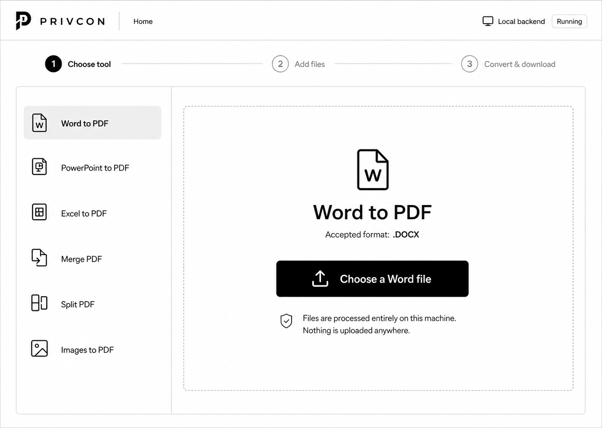

# PrivCon MVP Visual Design Contract

**Status:** Approved initial prototype direction  
**Applies to:** Dashboard shell and all six Phase 2 conversion routes  
**Reference viewport:** 1487 × 1058 px  
**Reference image:** `PrivCon_MVP_Prototype_Reference.png`



## 1. Authority and intent

This document is the visual source of truth for the PrivCon frontend. The reference image is not loose inspiration: its hierarchy, geometry, typography, monochrome treatment, icon language, density, and interaction emphasis define the MVP.

When this document and a generated mockup disagree, use this document and the approved reference image. Functional behavior and copy must continue to follow `PrivCon_Frontend_PRD_SRS_Design.md` and `PHASE_1_COMPLETION_SUMMARY.md`.

All design and review work stays in this local project. Do not use Google Stitch or the Stitch MCP.

## 2. Non-negotiable design principles

1. **Strict monochrome:** black, white, and neutral grays only. Status is communicated with icons and text, never color alone.
2. **One continuous utility surface:** avoid decorative cards, floating widgets, gradients, glass effects, soft shadows, or marketing sections.
3. **One obvious action:** each state has a single dominant black CTA.
4. **Persistent orientation:** the header, three-stage progress rail, and six-tool sidebar remain stable between routes and states.
5. **Local privacy is visible:** the backend status and the exact local-processing statement are always present.
6. **Typography does the hierarchy:** size, weight, alignment, and whitespace create emphasis; decoration does not.
7. **Icons are functional:** every icon identifies a tool, state, or action. No emoji or ornamental illustration.

## 3. Canonical page anatomy

The reference raster is **1487 × 1058 px**. Use these measured coordinates for 1:1 visual QA.

| Region | Reference bounds | Specification |
|---|---:|---|
| Global header | `x: 0–1486`, `y: 0–99` | 100 px high; white; 1 px bottom rule |
| Progress rail | `x: 0–1486`, `y: 100–212` | 113 px high; centered three-stage sequence |
| Main shell | `x: 39–1446`, `y: 213–1023` | 1408 × 811 px; 1 px neutral border; 9 px radius |
| Tool sidebar | `x: 40–423`, `y: 214–1022` | 384 px wide; right divider at `x: 423` |
| Task canvas | `x: 424–1445`, `y: 214–1022` | Continuous white surface |
| Dropzone | `x: 453–1416`, `y: 262–966` | 964 × 705 px; 1 px dashed border; 9 px radius |
| Active tool row | `x: 58–398`, `y: 262–344` | 340 × 82 px; neutral fill; 10 px radius |
| Primary upload CTA | `x: 681–1158`, `y: 644–733` | 478 × 90 px; black fill; 10 px radius |

The page must feel architectural and calm: hard alignment, large usable targets, thin rules, and generous whitespace.

### 3.1 Header

- Height: `100px`.
- Horizontal padding: `39px` left and `37px` right at the reference viewport.
- Brand group begins at `x: 39`, vertically centered.
- Use the official PrivCon mark and wordmark asset from `Privcon logos.jpg`; never type or approximate the wordmark.
- Brand lockup visible size: approximately `222 × 48px` including mark and wordmark.
- Vertical separator: `1px × 46px`, positioned 31 px after the wordmark.
- `Home` follows the separator with a 34 px gap.
- Right status group: `BackendMonitor` icon, `Local backend` label, then outlined `Running` status.
- Header content must never wrap at the desktop reference size.

### 3.2 Progress rail

- Three stages: `Choose tool`, `Add files`, `Convert & download`.
- Stage circles: `42 × 42px`, perfectly round, centered at approximately `x: 132`, `692`, and `1160`.
- Active circle: black fill with white numeral.
- Inactive circle: white fill, 2 px muted border, muted numeral.
- Active label: black, semibold.
- Inactive label: muted gray, regular.
- Connector lines: 1 px neutral rule; approximately 349 px for the first and 290 px for the second.
- Stage state changes only after the associated action is complete:
  - Stage 1: initial tool selection/upload-empty state.
  - Stage 2: accepted files are present and configuration/reordering is available.
  - Stage 3: converting, success, or recoverable conversion error.

### 3.3 Tool sidebar

Use this exact order and wording:

1. Word to PDF
2. PowerPoint to PDF
3. Excel to PDF
4. Merge PDF
5. Split PDF
6. Images to PDF

Rules:

- No category headings such as “PDF Tools,” “Image Converter,” “Audio Tools,” or “Archive Manager.”
- Row height: `82px` for the active row; inactive rows retain an equivalent interaction target.
- Sidebar horizontal padding: `18px`.
- Icon column begins 21 px inside the row; label begins 92 px inside the row.
- Approximate row centers at the reference size: `303`, `415`, `527`, `641`, `752`, and `864px` on the y-axis.
- Active fill: neutral gray; no colored accent, side bar, shadow, or badge.
- Inactive hover: a lighter neutral fill.
- Tool selection updates the task canvas without changing the shell geometry.

### 3.4 Task canvas and empty upload state

- Content padding around the dropzone: `29px` top, `29px` left, and `29px` right.
- The dropzone uses a long dash pattern, not dots.
- Empty-state content is centered on both axes as one vertical group.
- Word document icon: approximately `94 × 104px`.
- Gap from icon to title: `26px`.
- Title: `Word to PDF`.
- Format line: `Accepted format: .DOCX`, with `.DOCX` semibold.
- Gap from format line to CTA: `51px`.
- CTA label: `Choose a Word file` with a leading upload-tray icon.
- Privacy row appears 39 px beneath the CTA.
- Privacy copy must be exactly:

  `Files are processed entirely on this machine.`  
  `Nothing is uploaded anywhere.`

## 4. Design tokens

Use a three-layer token structure: primitive → semantic → component. Components must not contain raw color values.

### 4.1 Primitive tokens

```css
:root {
  /* Monochrome palette */
  --pc-black: #000000;
  --pc-gray-950: #111111;
  --pc-gray-800: #2d2d2d;
  --pc-gray-650: #5f5f5f;
  --pc-gray-500: #7a7a7a;
  --pc-gray-400: #9a9a9a;
  --pc-gray-300: #c8c9c8;
  --pc-gray-200: #d8d9da;
  --pc-gray-100: #ececed;
  --pc-gray-050: #f7f7f7;
  --pc-white: #ffffff;

  /* 4 px spacing base */
  --pc-space-1: 4px;
  --pc-space-2: 8px;
  --pc-space-3: 12px;
  --pc-space-4: 16px;
  --pc-space-5: 20px;
  --pc-space-6: 24px;
  --pc-space-7: 28px;
  --pc-space-8: 32px;
  --pc-space-10: 40px;
  --pc-space-12: 48px;
  --pc-space-16: 64px;

  --pc-radius-sm: 4px;
  --pc-radius-md: 8px;
  --pc-radius-lg: 10px;
  --pc-radius-full: 9999px;

  --pc-duration-fast: 120ms;
  --pc-duration-base: 180ms;
  --pc-ease-standard: cubic-bezier(0.2, 0, 0, 1);
}
```

### 4.2 Semantic tokens

```css
:root {
  --pc-bg-page: var(--pc-white);
  --pc-bg-surface: var(--pc-white);
  --pc-bg-subtle: var(--pc-gray-050);
  --pc-bg-selected: var(--pc-gray-100);

  --pc-fg-primary: var(--pc-black);
  --pc-fg-secondary: var(--pc-gray-650);
  --pc-fg-muted: var(--pc-gray-500);
  --pc-fg-inverse: var(--pc-white);

  --pc-border-default: var(--pc-gray-200);
  --pc-border-strong: var(--pc-gray-400);
  --pc-focus: var(--pc-black);

  --pc-action-primary: var(--pc-black);
  --pc-action-primary-hover: var(--pc-gray-950);
  --pc-action-primary-active: var(--pc-gray-800);
  --pc-action-disabled: var(--pc-gray-200);
}
```

### 4.3 Component tokens

```css
:root {
  --pc-header-height: 100px;
  --pc-progress-height: 113px;
  --pc-shell-radius: 9px;
  --pc-sidebar-width: 384px;
  --pc-tool-row-height: 82px;
  --pc-tool-row-radius: 10px;
  --pc-dropzone-radius: 9px;
  --pc-dropzone-border: 1px dashed var(--pc-border-strong);
  --pc-primary-height: 90px;
  --pc-primary-radius: 10px;
  --pc-primary-max-width: 478px;
  --pc-focus-ring: 0 0 0 2px var(--pc-white), 0 0 0 5px var(--pc-focus);
}
```

No drop shadow token is used in the MVP shell. Elevation is expressed with borders, fills, and spacing.

## 5. Typography

### 5.1 Typeface

- **UI family:** `Geist Sans Variable`.
- **CSS family:** `"Geist", "Segoe UI", sans-serif`.
- Bundle the variable font locally; do not request it from Google Fonts or another CDN.
- Visual acceptance is performed with Geist loaded. The fallback is only a resilience measure.
- The official `PRIVCON` wordmark is an image/vector asset, not live text.

### 5.2 Type scale

| Role | Size / line height | Weight | Tracking |
|---|---:|---:|---:|
| Tool-page title | `48 / 58px` | 700 | `-0.03em` |
| Primary CTA | `27 / 34px` | 600 | `-0.015em` |
| Sidebar label | `20 / 28px` | 400 | `-0.012em` |
| Sidebar active | `20 / 28px` | 600 | `-0.012em` |
| Progress label | `19 / 28px` | 400 | `-0.01em` |
| Progress active | `19 / 28px` | 600 | `-0.01em` |
| Header navigation | `18 / 26px` | 500 | `-0.01em` |
| Body / format line | `20 / 30px` | 400 | `-0.015em` |
| Format emphasis | `20 / 30px` | 600 | `-0.015em` |
| Backend label | `17 / 24px` | 400 | `-0.01em` |
| Status pill | `16 / 22px` | 400 | `-0.01em` |
| Helper / error text | `15 / 22px` | 400 | `0` |

Rules:

- Use sentence case for labels and actions.
- Use the source-file extension in uppercase.
- Do not use all caps outside the official wordmark and file extensions.
- Headings are compact and never exceed two lines.
- Do not substitute Inter, Roboto, Arial, or a system font during visual QA.

## 6. Logo and icon system

### 6.1 Brand assets

- Source: `Privcon logos.jpg`.
- The header uses the horizontal mark + wordmark lockup shown in the approved prototype.
- Future implementation must create clean local production assets from the approved logo source: `privcon-mark.svg`, `privcon-wordmark.svg`, and `privcon-lockup.svg` or lossless equivalents.
- Preserve proportions and clear space. Do not redraw the logo with CSS, substitute a letter P, or type the wordmark.

### 6.2 Custom interface icons

Create one local icon set with these names:

- `BackendMonitor`
- `WordFile`
- `PowerPointFile`
- `SpreadsheetFile`
- `MergeFile`
- `SplitFile`
- `ImageFile`
- `UploadTray`
- `PrivacyShieldCheck`
- `RemoveFile`
- `DragHandle`
- `SuccessCheck`
- `ErrorAlert`
- `ArchiveFile`

Construction rules:

- Base grid: `24 × 24`.
- Stroke: `2px` at 24 px; scale proportionally for larger display sizes.
- Stroke color: `currentColor`.
- Caps and joins: round unless a document corner requires a square join.
- No gradients, multicolor fills, emoji, icon-font glyphs, or mixed icon families.
- Document icons share the same outer page silhouette and folded-corner geometry; only the internal identifier changes.
- Tool sidebar icons render in a `40 × 40px` optical box.
- Header status icon renders at `28 × 28px`.
- Primary CTA icon renders at `38 × 38px`.
- Empty-state document icon renders at approximately `94 × 104px` using the same geometry as its sidebar counterpart.
- Filled areas are limited to functional symbols such as a keyhole or selected-state check. Most icons remain outlines.

## 7. Component specifications

### 7.1 Primary button

| State | Background | Text | Border | Behavior |
|---|---|---|---|---|
| Default | Black | White | None | Pointer |
| Hover | Gray 950 | White | None | 120 ms color transition |
| Active | Gray 800 | White | None | No scale bounce |
| Focus-visible | Black | White | None | Monochrome 2 px + 5 px focus ring |
| Disabled | Gray 200 | Gray 500 | None | `not-allowed`; no opacity-only state |
| Loading | Black | White | None | Label becomes status text; icon becomes spinner |

The empty-state CTA stays a single horizontal control with one leading icon and one text label. No secondary action appears beside it.

### 7.2 Tool navigation item

- Full-row button/link; minimum target height `56px`, reference target `82px`.
- Active: `--pc-bg-selected`, semibold label, unchanged black icon.
- Hover: `--pc-bg-subtle`.
- Focus-visible: inset black outline plus external white separation.
- Disabled is not expected for MVP routes.

### 7.3 Dropzone

- Default: white background, 1 px dashed strong-neutral border.
- Hover: border becomes black.
- Drag-active: subtle-gray background and black solid border.
- Focus-visible: same focus ring as the primary button.
- Invalid drop: keep the monochrome shell; show `ErrorAlert` plus explicit text below the action area.
- Keyboard: `Enter` or `Space` opens the local file picker.
- The entire large inner region is clickable, but the CTA remains the obvious action.

### 7.4 Backend status

- `BackendMonitor` + `Local backend` + outlined status.
- `Running`: white pill, 1 px neutral border, black text.
- `Unavailable`: same pill structure with `ErrorAlert` and explicit `Not running`; do not rely on red.
- Dashboard health check is quiet and never blocks navigation.

### 7.5 Privacy statement

- Always use `PrivacyShieldCheck` with the exact two-line promise.
- Keep it visually subordinate to the CTA but readable at normal body size.
- Do not replace it with a marketing paragraph or security badge collection.

## 8. Page and state consistency

All pages reuse the same shell. Only the active sidebar item and task-canvas contents change.

| Route | Empty-state icon | Title | Accepted line | Primary action |
|---|---|---|---|---|
| `/word-to-pdf` | `WordFile` | Word to PDF | Accepted format: `.DOCX` | Choose a Word file |
| `/ppt-to-pdf` | `PowerPointFile` | PowerPoint to PDF | Accepted format: `.PPTX` | Choose a PowerPoint file |
| `/excel-to-pdf` | `SpreadsheetFile` | Excel to PDF | Accepted format: `.XLSX` | Choose an Excel file |
| `/merge-pdf` | `MergeFile` | Merge PDF | Accepted format: `.PDF` | Choose PDF files |
| `/split-pdf` | `SplitFile` | Split PDF | Accepted format: `.PDF` | Choose a PDF file |
| `/images-to-pdf` | `ImageFile` | Images to PDF | Accepted formats: `.JPG .JPEG .PNG .WEBP` | Choose image files |

### 8.1 Files selected

- Stage 2 becomes active.
- Replace the empty-state center group with a single continuous file/configuration surface.
- File rows use thin separators, not individual cards.
- Merge and Images show visible ordering, custom `DragHandle`, position number, file name, size, and Remove action.
- Keyboard reorder hint: `Reorder with Alt + ↑ or ↓`.
- The dominant action remains black and names the result: `Merge PDFs`, `Create PDF`, or `Convert to PDF`.

### 8.2 Processing

- Stage 3 becomes active.
- Preserve the selected file summary.
- Show one horizontal indeterminate progress rule and `Processing locally…`.
- Supporting copy: `This usually takes less than a minute. Keep this tab open.`
- `Cancel` is secondary and outlined.
- Do not show fake percentages when the backend does not provide progress.

### 8.3 Success

- Use `SuccessCheck` and explicit success text; remain monochrome.
- Show deterministic output filename (`merged.pdf`, `images.pdf`, or the appropriate returned filename).
- One dominant download action, one secondary repeat-tool action, and one quiet `Convert again` action.
- Keep the privacy statement visible.
- No confetti, illustration, green wash, or celebration card.

### 8.4 Error

- Use `ErrorAlert` plus the mapped human-readable message from `PrivCon_Frontend_PRD_SRS_Design.md`.
- Keep the selected file where retry is supported.
- Provide one obvious `Try again` action and a secondary edit/remove action when relevant.
- Do not show raw codes, stack traces, local filesystem paths, or red-on-red surfaces.

## 9. Motion

- Motion is restrained and functional.
- Hover/focus color transitions: `120ms`.
- Panel/content state transition: `180ms`, opacity plus no more than `4px` vertical translation.
- Indeterminate progress is the only continuous animation.
- Respect `prefers-reduced-motion`; remove translation and continuous shimmer.
- No spring motion, bouncing CTAs, parallax, or entrance choreography.

## 10. Responsive behavior

The approved visual target is desktop-first.

### 10.1 Reference and large desktop (`≥ 1280px`)

- Preserve the measured 100 px header and 113 px progress rail.
- Main shell uses approximately 2.6% horizontal page margin, capped to the reference proportions.
- Sidebar remains 384 px at the 1487 px reference and may use `clamp(300px, 25.8vw, 384px)`.
- Dropzone fills the remaining task canvas with 29 px inset.

### 10.2 Compact desktop/tablet (`768–1279px`)

- Sidebar may reduce to 240–300 px.
- Reduce page title to 40 px and CTA type to 22 px.
- Keep all six tools visible and keyboard accessible.
- Progress connectors flex; labels may shorten only if their meaning is preserved.

### 10.3 Narrow viewport (`< 768px`, best effort)

- Header may wrap the backend status to a second row.
- Tool navigation becomes a horizontal scroll list above the task canvas.
- Progress rail keeps three numbered stages with compact labels.
- Do not hide tool choice or privacy status behind a menu.

## 11. Accessibility contract

- WCAG AA contrast minimum: 4.5:1 for normal text and 3:1 for large text/UI boundaries.
- Every interactive control has a visible focus state.
- Dropzone and reordering are fully keyboard operable.
- Status changes use `aria-live`.
- Active navigation uses `aria-current="page"`.
- Progress uses an ordered semantic structure with current-step text.
- Icons that repeat visible labels are `aria-hidden`; standalone status icons have accessible names.
- Minimum pointer target: `44 × 44px`.
- State is never communicated by color alone.

## 12. Content and privacy rules

- Use plain, direct language.
- Never imply cloud upload, an account, storage, history, or collaboration.
- Never show external-service logos.
- Uploaded files remain in browser memory only for the active flow and are sent only to the configured local PrivCon backend.
- No analytics, telemetry, external fonts, remote icon packages, or third-party file services.

## 13. Visual QA checklist

Before accepting any new screen:

- [ ] Header height, brand lockup, Home link, and backend status match the reference.
- [ ] Progress rail geometry and active stage are correct.
- [ ] Sidebar contains exactly the six approved tools in the approved order.
- [ ] Active sidebar treatment is neutral fill only.
- [ ] Task canvas aligns to the same divider and inset grid.
- [ ] Geist is loaded locally and type roles match this document.
- [ ] Icons come from the single custom PrivCon icon set.
- [ ] Primary action is unmistakable and singular.
- [ ] Privacy statement is present and exact.
- [ ] No extra cards, gradients, shadows, color accents, emoji, or decorative clutter were introduced.
- [ ] Keyboard, focus, disabled, processing, success, and error states are visible and understandable.
- [ ] A 1:1 screenshot overlay against `PrivCon_MVP_Prototype_Reference.png` shows no unexplained geometry drift.

## 14. Change control

Changes to the font family, brand treatment, icon family, palette, header height, progress rail, sidebar order, shell proportions, or primary CTA style require explicit user approval and an update to this document before implementation.

